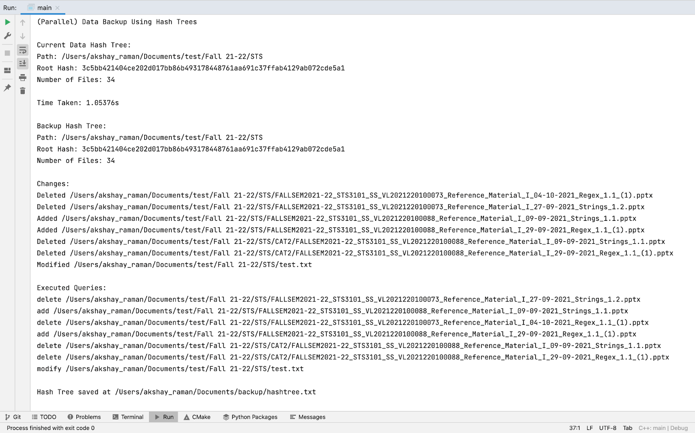
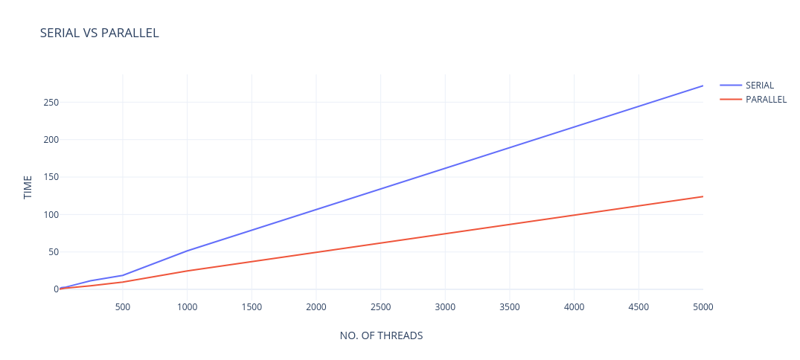
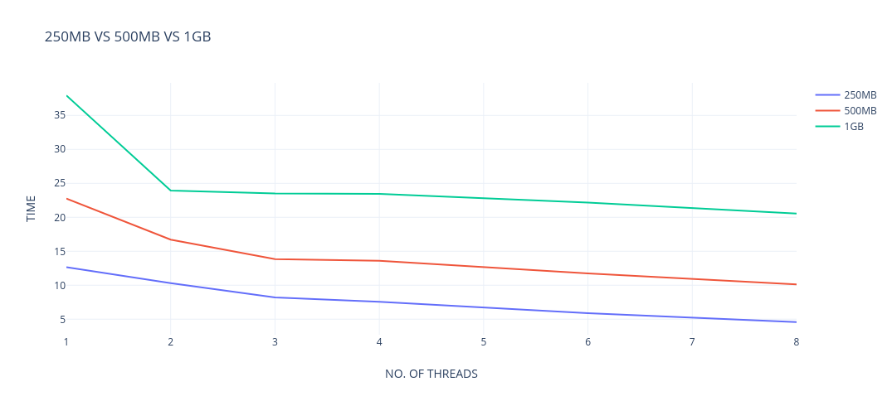

# Hash Tree Data Backup

## About

In this project, I have implemented an efficient backup system using hash trees. Since directories in all operating systems are implemented in a tree-like structure, it is possible to store the state of a file system using a hash tree. By using a hash tree, we can easily find which files have been modified by just checking the hashes of the tree in a top-down manner.

The project has three important parts:
1. Construction of Hash Tree
2. Comparing Hash Trees (to find modified files)
3. Backup The Changes

## Construction of Hash (Merkle) Tree

A Merkle tree is a generalisation of the hash list and is a hash-based data structure. It is a tree structure in which each leaf node is a hash of a block of data, and each non-leaf node is a hash of its children. Generally, Merkle trees have a branching factor of 2, where each node has a maximum of 2 children. However, an n-ary hash tree is required here for the file system.

<p align = "center">

</p>

The hash-tree folder consists of the implementation of the hash tree class which build a hash tree. It can be built using two ways:
1. From **file path** - Build a hash tree of data with the root as the input file path
2. From **text file** - Build the hash tree data structure from an existing hash tree (stored in a text file as an adjacency list)

The hash tree is built from the file path using a DFS-like approach. I made use of OpenMP tasks to parallelise the building process so that different threads can handle different branches (and nodes) of the tree simultaneously. The SHA256 implementation from the C++ hash-library is used to compute the hash of data. The hash tree is stored as an adjacency list using STL's map data structure.

To build a hash tree from a data/file path. Run the following code:
```
HashTree *ht_data = new HashTree(dataPath, false);
ht_data->print_metadata();
```

The hash tree can be stored/saved as a text file in the form of an adjancency list. Below is the format of the text file:
```
src1|src1_hash|dest1|dest1_hash|dest2|dest2_hash| ... |destn|destn_hash 
src2|src2_hash|dest1|dest1_hash|dest2|dest2_hash| ... |destn|destn_hash 
. 
. 
. 
srcm|srcm_hash|dest1|dest1_hash|dest2|dest2_hash| ... |destn|destn_hash 
```

To build the hash tree from the text file. Run the following code:
```
HashTree *ht_backup = new HashTree(backupPath+"hashtree.txt", true);
ht_backup->print_metadata();
```

## Comparing Hash Trees

Now, say we have the hash tree of a previous backup and the hash tree of the current system. It is possible to find what new changes have been made by simply comparing the hash trees. This way we can efficiently find which files have been modified and only backup those changes. This is much better that making a completely new copy of all the contents of the system. The hash tree of the backup can be retrieved from the text file and the current hash tree can be built directly from the file path.

Hash trees are compared by comparing the hashes of each node. BFS is used for the comparison. If the hashes for a particular node matches, then none of the files below its branch has been modified and we do not have to explore them. For the comparison to happen correctly, it is crucial for the children in the adjacency list to be sorted (alphanumerically). The function compareTrees takes two hash trees as arguments are generates queries in a global query vector. The queries are the different files and folders which have been modified. There are three kinds of queries: add, modify, and delete. The function can be called the following way:
```
compareTrees(ht_backup, ht_data);
```

## Backup The Changes

Finally, the queries are executed on the existing backup itself. This has the benefit of saving space since no new backup needs to be created. However, the program can easily be modified to create a new backup. The queries are executed using the copy and remove_all functions from teh file system library. The new hash tree replaces the old one using the save function. OpenMP work-sharing constructs is also used to execute multiple queries in parallel. A dynamic schedule is used since queries take different amounts of time to execute. The query class has two member functions: "print" which displays the query information and "execute" which executes the query.

## Sample Output

<p align = "center">

</p>

## Results

The parallel code performed much better than the serial code. On average, the parallel code performed at least 2x better than the serial code. Below is the table showing the time comparison between parallel code (4 threads) and serial code.

<div align="center">

| Size (mb) | Serial (sec) | Parallel (4 threads) (sec) |
| :-----: | :-----: | :-----: |
| 10 | 0.810 | 0.295 |
| 25 | 2.350 | 0.913 |
| 50 | 2.724 | 1.504 |
| 250 | 11.481 | 4.840 | 
| 500 | 18.680 | 9.759 |
| 1000 | 51.533 | 24.750 |
| 5000 | 272 | 124 |

</div>
 
<p align = "center">

</p>

The program also performs slightly better as the number of threads are increased. The performance depends on various factors such as the size of the data and the algorithm used by the CPU to schedule OpenMP tasks. However, we do observe that the difference in performance between serial and parallel is much more noticable for large data. 

<div align="center">

| No. of Threads | Time - 250mb | Time - 500mb | Time - 1gb |
| :-----: | :-----: | :-----: | :-----: |
1 | 12.67 | 22.772 | 37.938 |
2 | 10.301 | 16.72 | 23.95 |
3 | 8.200 | 13.84 | 23.502 |
4 | 7.572 | 13.59 | 23.45 |
6 | 5.899 | 11.75 | 22.182 |
8 | 4.573 | 10.12 | 20.56 |

</div>

<p align = "center">

</p>

## Note

For those not interested in the openMP code, a version of the code without openMP can be found in the **serial branch**.
